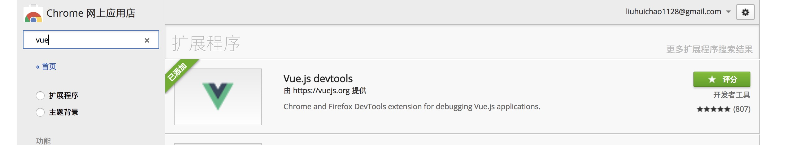
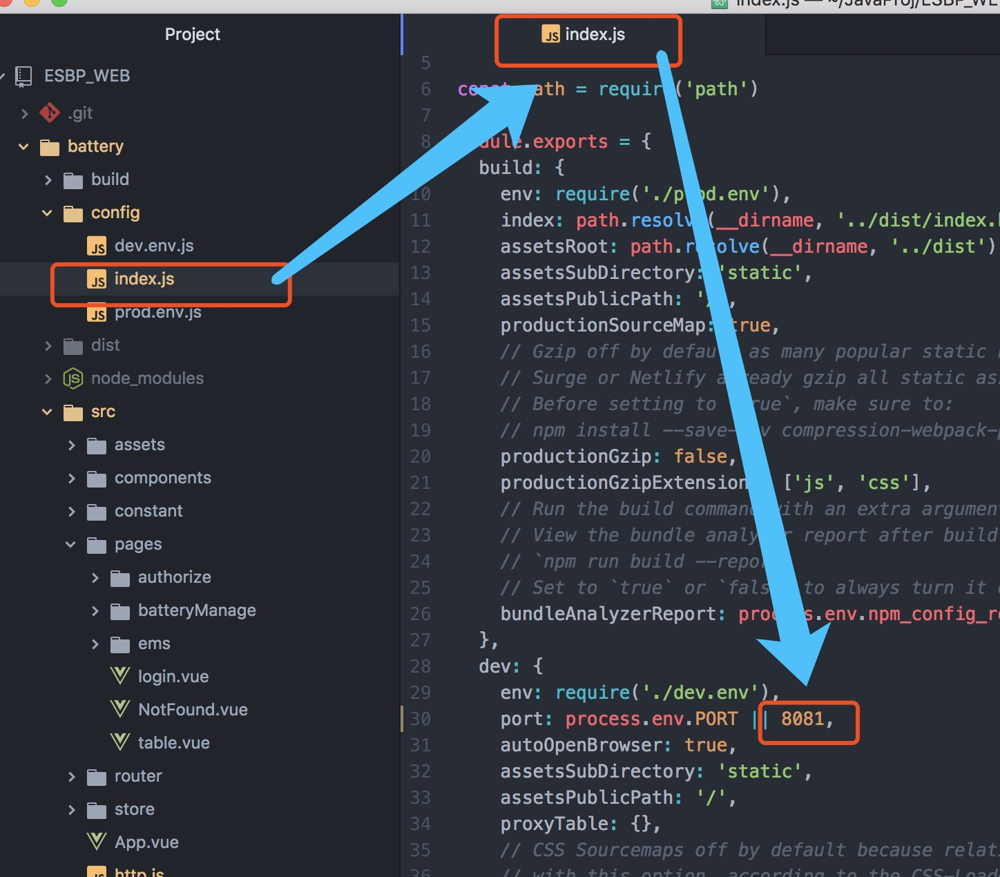
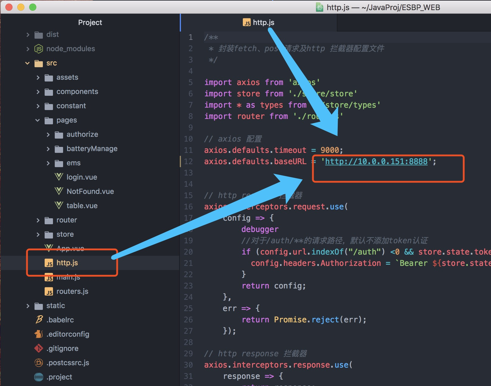
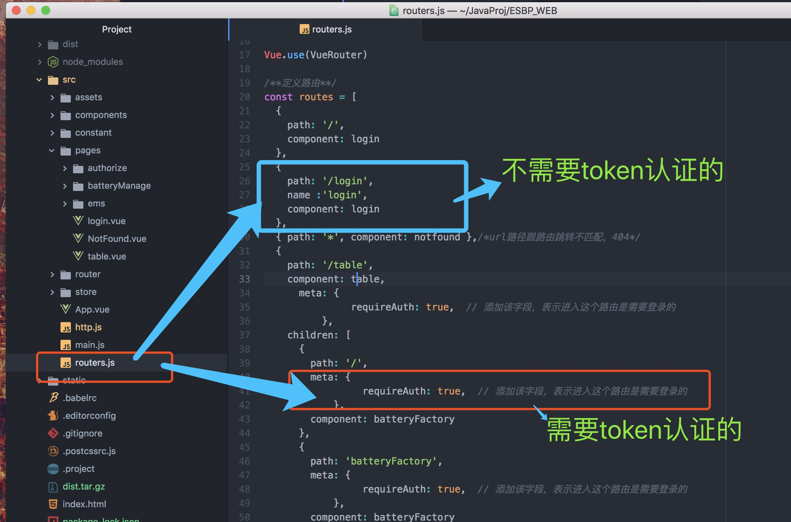
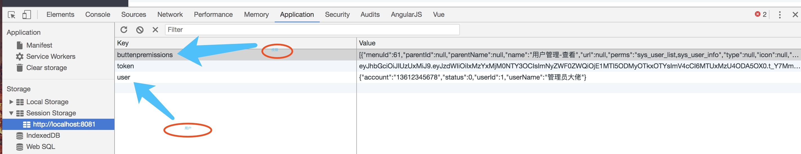

# 系统key point
- spring boot
- spring security：用于token认证
- jwt/token认证
- vue
- vue:axios:用于前端进行http请求
- vue:routers：用于路由跳转控制
- es6
# 参考资料
- es6 :[es6](http://es6.ruanyifeng.com/)
- element：[element文档](http://element-cn.eleme.io/#/zh-CN/component/installation)
- axios: [axios文档](https://github.com/axios/axios)
- 科学上网工具：[latern](https://github.com/getlantern/lantern)
- 调试工具-vue:
-------

-------
调试方式：
------
 
-------
- 前端开发工具：
-- `sublime`:链接: https://pan.baidu.com/s/1i5cS7cD 密码: 8sc3
--`atom`;
#前端代码介绍

## 修改启动端口号
 

-------
## 修改连接的base url地址


-------
##前端配置token认证
本项目中，除了登陆，其他默认都需要token认证，请在路由配置里面，加入如下代码：
```
meta: {
               requireAuth: true,  // 添加该字段，表示进入这个路由是需要登录的
          },
```
对比：
------

------
## 按钮权限配置
本系统，对系统的权限精确到按钮，前端采用指令判断用户是否含有某个按钮的权限，如果含有此权限，则会在前端页面生成此按钮，如果不含有按钮的操作权限，则默认不显示。
实现按钮权限控制指令l:
```
//权限检查方法
  Vue.prototype.$_has = function(value) {
    debugger
    let isExist=false;
    let buttonpermsStr=sessionStorage.getItem("buttenpremissions");
    if(buttonpermsStr==undefined || buttonpermsStr==null){
      return false;
    }
    let buttonperms=JSON.parse(buttonpermsStr);
    for(let i=0;i<buttonperms.length;i++){
      if(buttonperms[i].perms.indexOf(value)>-1){
        isExist=true;
        break;
      }
    }
    return isExist;
  };
```
此代码为v-has指令的定义，开发使用方式：
```
<el-button type="primary" class="btns first" @click="querylist" v-has="'sys_user_list'">查询</el-button>
          <el-button class="btns" @click="showAddView" v-has="'sys_user_save'">新增</el-button>
          <el-button  class="btns" @click="modifyUserItem" v-has="'sys_user_update'">修改</el-button>
          <el-button class="btns" @click="delItem" v-has="'sys_user_delete'">删除</el-button>
```
只需使用`v-has`判断是否当前登陆用户含有此项权限即可。
## session storage存储内容

浏览器本地存储采用sessionstorage，token默认过期时间为7天，用户登陆时候，会默认加载用户权限数据和用户数据，开发中如有使用，请从里面取值；
