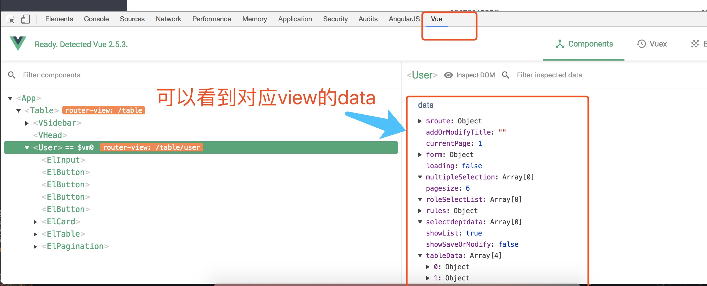

# 系统key point
- spring boot
- spring security：用于token认证
- jwt/token认证
- vue
- vue:axios:用于前端进行http请求
- vue:routers：用于路由跳转控制
- es6
# 参考资料
- es6 :[es6](http://es6.ruanyifeng.com/)
- element：[element文档](http://element-cn.eleme.io/#/zh-CN/component/installation)
- axios: [axios文档](https://github.com/axios/axios)
- 科学上网工具：[latern](https://github.com/getlantern/lantern)
- 调试工具-vue:
-------

-------
调试方式：
------
 
-------
- 前端开发工具：
-- `sublime`:链接: https://pan.baidu.com/s/1i5cS7cD 密码: 8sc3
--`atom`;
#npm常用命令
##vue-cli创建项目
```
npm install --global vue-cli
vue init webpack testvue
npm install
npm run dev
```
##项目常用命令
```
# install dependencies
npm install

# serve with hot reload at localhost:8080
npm run dev

# build for production with minification
npm run build

# build for production and view the bundle analyzer report
npm run build --report
```

#前端代码介绍

## 修改启动端口号
 

-------
## 修改连接的base url地址


-------
##前端配置token认证
本项目中，除了登陆，其他默认都需要token认证，请在路由配置里面，加入如下代码：
```
meta: {
               requireAuth: true,  // 添加该字段，表示进入这个路由是需要登录的
          },
```
对比：
------

------
## 按钮权限配置
本系统，对系统的权限精确到按钮，前端采用指令判断用户是否含有某个按钮的权限，如果含有此权限，则会在前端页面生成此按钮，如果不含有按钮的操作权限，则默认不显示。
实现按钮权限控制指令l:
```
//权限检查方法
  Vue.prototype.$_has = function(value) {
    debugger
    let isExist=false;
    let buttonpermsStr=sessionStorage.getItem("buttenpremissions");
    if(buttonpermsStr==undefined || buttonpermsStr==null){
      return false;
    }
    let buttonperms=JSON.parse(buttonpermsStr);
    for(let i=0;i<buttonperms.length;i++){
      if(buttonperms[i].perms.indexOf(value)>-1){
        isExist=true;
        break;
      }
    }
    return isExist;
  };
```
此代码为v-has指令的定义，开发使用方式：
```
<el-button type="primary" class="btns first" @click="querylist" v-has="'sys_user_list'">查询</el-button>
          <el-button class="btns" @click="showAddView" v-has="'sys_user_save'">新增</el-button>
          <el-button  class="btns" @click="modifyUserItem" v-has="'sys_user_update'">修改</el-button>
          <el-button class="btns" @click="delItem" v-has="'sys_user_delete'">删除</el-button>
```
只需使用`v-has`判断是否当前登陆用户含有此项权限即可。
## session storage存储内容

浏览器本地存储采用sessionstorage，token默认过期时间为7天，用户登陆时候，会默认加载用户权限数据和用户数据，开发中如有使用，请从里面取值；


##nginx
- nginx地址：10.0.1.101
- 位置：/usr/local/nginx/
- 访问地址：10.0.1.101:80

## 启动
```
[root@bj-esbp-mid1 sbin]# ./nginx
```
## 查看进程
```
[root@bj-esbp-mid1 sbin]# ps -ef | grep nginx  
root     14982     1  0 14:13 ?        00:00:00 nginx: master process ./nginx
nobody   14983 14982  0 14:13 ?        00:00:00 nginx: worker process
root     14989  2421  0 14:16 pts/0    00:00:00 grep nginx
```
## 重启
```
./nginx -s reload
```
# 前端发布
- 1、npm run build

- 2、把dist里的文件打包上传至服务器

项目部署结构：

/data/www/ESBP_WEB/dist
|-----index.html
|-----js
|-----css
|-----images
....

- 3、配置nginx监听80端口：
编辑 `/usr/local/nginx/conf`下面的`nginx.conf`文件:
修改访问的默认文件位置：

```
location / {
            root   /data/www/ESBP_WEB/dist;
            index  index.html index.htm;
        }
```

- 4、浏览器访问http://10.0.1.101/即可

#开发跨域设置
修改`config/index.js`文件：
```
proxyTable: {
      '/batteryhisurl': {
         target: 'https://www.baidu.com',
         changeOrigin: true,
         pathRewrite: {
           '^/batteryhisurl': '' //重写接口，去掉/api
         }
      }
```
当访问`http://localhost:8080/batteryhisurl`时候就会自动替换为target；
#nginx跨域设置
```
server {
	listen 80;
	server_name t8.aicuishou.com;
	location / {
		root /data/www/saas_manager_web/dist/;
    	}
	location /api {
		rewrite /api/(.+) /$1 break;
		add_header Access-Control-Allow-Origin *;
  		add_header Access-Control-Allow-Headers X-Requested-With;
  		add_header Access-Control-Allow-Methods GET,POST,OPTIONS;
        	proxy_set_header   X-Real-IP $remote_addr;
        	proxy_set_header   Host      $http_host;
        	proxy_pass         http://1.1.1.1:8080;
    	}
        location /t4 {
                rewrite /t4/(.+) /$1 break;
                add_header Access-Control-Allow-Origin *;
                add_header Access-Control-Allow-Headers X-Requested-With;
                add_header Access-Control-Allow-Methods GET,POST,OPTIONS;
                proxy_set_header   X-Real-IP $remote_addr;
                proxy_set_header   Host      $http_host;
                proxy_pass         http://2.2.2.2:7080;
        }
  }
```
本项目中，采用后端跨域方式，前端无需配置，上面提供的两种跨域方式仅供参考。
