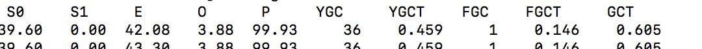
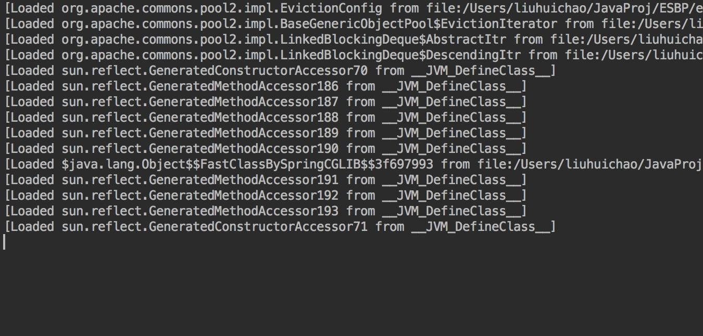

# 问题描述
> 系统中有一个导出excel的功能，每天都会有人在固定时间，去做一些导出的功能，但是日积月累时间长了之后，发现系统在某一刻导出的时候，会出现假死性卡死，观察系统，会发现这时候一直在进行FGC，且永久带达到100%，始终无法回收。尝试加大永久代内存，发现只是暂时性地拖系统卡死的时间，并不能解决永久代持续增长的问题。


 观察系统中的代码，先去库里面根据查询条件，查出一些数据，之后去创建workbook(使用java poi),创建worksheet,创建row，发射获取对象属性值，创建cell,赋值给cell,完成一行数据的创建，循环获取到的数据list,创建完成sheet之后返回。

 经过反复试验，发现问题出现在代码：
 ```java
 map = FieldsCollector.getFileds(t);
 ```
 ```
 public static Map<String, FieldEntity> getFileds(Object object) throws SecurityException, IllegalArgumentException, NoSuchMethodException, IllegalAccessException, InvocationTargetException {
        Class clazz = object.getClass();
        Field[] fields = getBeanFields(clazz, new Field[100], 2);
        Map<String, FieldEntity> map = new HashMap();

        for(int i = 0; i < fields.length; ++i) {
            if (fields[i] != null && !"serialVersionUID".equals(fields[i].getName())) {
                Object resultObject = invokeMethod(object, fields[i].getName(), (Object[])null);
                map.put(fields[i].getName(), new FieldEntity(fields[i].getName(), resultObject, fields[i].getType()));
            }
        }

        return map;
    }


    public static Object invokeMethod(Object owner, String fieldname, Object[] args) throws SecurityException, NoSuchMethodException, IllegalArgumentException, IllegalAccessException, InvocationTargetException {
           Class ownerClass = owner.getClass();
           Method method = null;
           method = ownerClass.getMethod(GetterUtil.toGetter(fieldname));
           Object object = null;
           object = method.invoke(owner);
           return object;
       }

 ```

 添加调试参数：
 ```
-XX:PermSize=87m
-XX:+TraceClassLoading
-XX:+TraceClassUnloading
 ```

 打印出类的加载卸载信息：

 

 发现调用反射的时候，会产生很多类，一直在load,导致perm持续增长。

 加入jvm参数：

 ```
 -Dsun.reflect.inflationThreshold=2147483647
 ```
反复运行反射取值的那段代码，发现ok的，没毛病了。
> ps:发现了很多-Dsun.reflect.inflationThreshold=0的教程，有网友指出，IBM跟sun的jdk设置不同。

参考：
[http://blog.csdn.net/stevendbaguo/article/details/54972584](http://blog.csdn.net/stevendbaguo/article/details/54972584)

[https://stackoverflow.com/questions/16130292/java-lang-outofmemoryerror-permgen-space-java-reflection](https://stackoverflow.com/questions/16130292/java-lang-outofmemoryerror-permgen-space-java-reflection)
