# 1. BF : Brute Force 暴力检索
首先，暴力检索，思路简单，例如，在source = `abcebcd` 中搜索 target =`bcd`:

|    |  a  |  b | c | e  |b   | c  | d|
|  ---- |  ----  | ----  | ----  | ----  | ----  | ----  |----  |
| 第一次移动| b  | c |d | | | | |
| 第二次移动|   | b |c |d | | | |
| 第三次移动|   |  |b |c | d| | |
| 第四次移动|   |  | |b |c| d| |
| 第五次移动|   |  | | |b| c|d |
将target字符的第一位分别于source的每一位对齐之后，对待匹配字符从第一位到最后一位进行逐位匹配直至每一位都匹配上。
如果出现某一位不匹配，则要向后移动。
代码如下：

```java
public int strStr(String haystack, String needle) {
        if (haystack.length() < needle.length()) {
            return -1;
        }
        if ("".equals(haystack) && "".equals(needle)) {
            return 0;
        }
        if (haystack == null || haystack.length() < 1) {
            return -1;
        }
        if (needle == null || needle.length() < 1) {
            return 0;
        }
        char[] haystackChar = haystack.toCharArray();
        char[] needleChar = needle.toCharArray();
        for (int i = 0; i < haystackChar.length; i++) {
            if (isMatch(haystackChar, i, needleChar)) {
                return i;
            }
        }
        return -1;
    }

    private boolean isMatch(char[] source, int beginIndex, char[] needle) {
        for (int i = 0; i < needle.length; i++) {
            if (i + beginIndex > source.length - 1) {
                return false;
            }
            if (source[i + beginIndex] != needle[i]) {
                return false;
            }
        }
        return true;
    }
```
时间复杂度在n方，是种写起来比较简单但是时间复杂度比较高的算法。这里我们主要是用这种暴力求解的方式，来引入下面其他算法。

# 2. KMP
## 最长公共前后缀
在开始了解KMP之前，我们先掌握这个最长公共前后缀的求解方法。
下面我们先肉眼看一下，最长公共前后缀：
例如，对于字符串 `abccab`:
- 前缀字符串为：`a`,`ab`,`abc`,`abcc`,`abcca`
- 后缀字符串为：
`b`,`ab`,`cab`,`ccab`, `bccab`
其中，最长公共前后缀为`ab`。
另外，我们拆解这个字符串，看看对于它的各个位置上，如果0开始截取到index位，最长公共前后缀长度表：

|  a(index=0)  |  b(index=1)  | c(index=2)  | c(index=3)  | a(index=4)   | b(index=5)  |
|  ----  | ----  | ----  | ----  | ----  | ----  |
| 0  | 0 |0 |0 |1|2 |

观察上面表，index 在[0,3]之间，都不存在公共前后缀；index=4时候，对于`abcca`,公共前后缀只有`a`；index=5时候，对于`abccab`,最长公共前后缀为`ab`；
观察上表的最长公共前缀长度值的变化，会发现最大值 ，是逐渐上升上去的，随着字母的累加到达最大，并且最大值依赖于前面的值。感觉是不是有点儿动态规划那意思。


```java
 /**
     * 获取最长公共前后缀长度
     *
     * @param s
     * @return
     */
    private int[] getNext(String s) {
        int[] result = new int[s.length()];
        int len = 0, i = 1;
        while (i < s.length()) {
            if (s.charAt(i) == s.charAt(len)) {
                result[i++] = ++len;
            } else if (len == 0) {
                //匹配失败，匹配长度为 0，无公共串
                result[i++] = 0;
            } else {
                //匹配失败，看看公共串有没有前缀和后缀相等的部分，有的话，相等部分的后一个字母比较
                  // aafaaa ,到最后一个a时候，匹配失败，len=2,根据前面匹配的公共串，看看公共串的公共串
                len = result[len - 1];
            }
        }
        return result;
    }
```
其中，比较有意思的代码` len = result[len - 1]` :
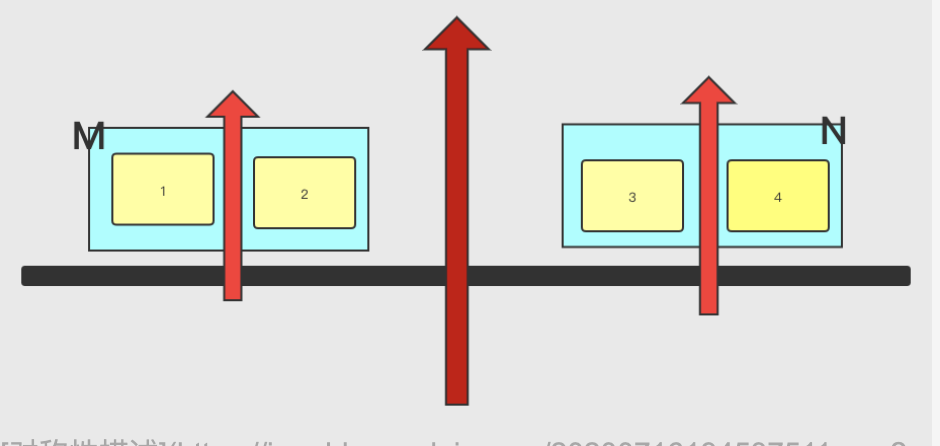
- 如果M和N为最长公共前后缀。则1，2部分等于3，4部分.且1=3，2=4，
- 如果1和2部分为M的最长公共前后缀，且1=2，那么刺激的来了，则`1=4`。

所以计算M+N之后的最长公共前后缀长度，初始值可以从`result[len - 1]`计算，其中len为M+N段最长公共前后缀长度。

前面也说了，最长公共前后缀的长度，其实是基于前面的结果计算的。
## 回到KMP

对于13个人，其中肯定是有一个人的生日与另一个人的生日在同一月份。同样，对于字符串来讲，字符也也是会有重复的。`KMP`就是充分利用字符的前后重复度来匹配字符串的。

逐个匹配时，当中间某个字符不匹配时，例如：source=`ababababc`中查找target=`ababc`时候，我们先构建target的最长公共前后缀表：

|  a(index=0)  |  b(index=1)  | a(index=2)  | b(index=3)  | c(index=4)   |
|  ----  | ----  | ----  | ----  | ----  |
| 0  | 0 |1 |2 |0|


当source的index=0逐个字符匹配失败时候，按照BF无脑的匹配规则，我们会回退到target字符串的index=0位置，然后在source串上index=1的位置接着查找。

但是在KMP中，因为我们有被查找串串的最长公共前后缀长度表，利用target字符的表，我们会回退到target字符串的index=2位置，同时，由于source中，index=[2,3]处的ab,并不匹配target的第二对ab,所以source的指针不用回退，在source串上index=4的位置接着往下对比查找。

通过对比回退位置，我们发现，利用我们求的回退表，可以在每次不匹配时候，回退尽量少的位置。

```java
  /**
     * KMP
     *
     * @param haystack
     * @param needle
     * @return
     */
    public int strStr2(String haystack, String needle) {
        if (haystack.length() < needle.length()) {
            return -1;
        }
        if ("".equals(haystack) && "".equals(needle)) {
            return 0;
        }
        if (haystack.length() < 1) {
            return -1;
        }
        if (needle.length() < 1) {
            return 0;
        }
        int[] next = getNext(needle);
        int i = 0;
        int j = 0;
        while (i < haystack.length() && j < needle.length()) {
            if (haystack.charAt(i) == needle.charAt(j)) {
                i++;
                j++;
            } else {
                //回退
                if (j == 0 || i == 0) {
                    //第一个就不匹配就得往后走了
                    i++;
                    j++;
                }
                j = next[j - 1]; //利用公共前缀表，获取回退位置
            }
        }
        return j == needle.length() ? i - j : -1;
    }
```
## 总结
对于KMP算法，首先要根据被查找字符串，构建最长公共前后缀的表，我们要利用前后的对称性，在遇到不匹配字符时候，去查表，获取回退位置。

KMP时间复杂度为N，但是个人感觉，这个实战起来，很依赖于被查找串的重复性，重复性越大，查找起来越容易。

# 3. Robin-Karp
这个方法主要是利用hash,对每一位计算hash值，将hash值进行相加，如果查找串中，匹配到相同的一个hash值，则，此时就匹配到了字符串。除了暴力算法，个人感觉这个是时间复杂度为N的算法里面最好理解的了。
首先来看单位的char,是如何计算hash值的：
```java
/**
    * ----robin carp--------
    **/
   public int charToIntVale(char s) {
       return s - 'a';
   }
```

对于s,我们定义单个s相对于a的位置距离，（你也可以用编码值相减的结果来理解）为hash值。

例如，对于abcd中的c,这个值为2，因为c距离a差2。
对于`abcd`, 得到相对位置数组[0,1,2,3],计算`h =0×26^3+1×26^2+2×26^1+3×26^0`
对于待匹配字符，我们采用如下公式:
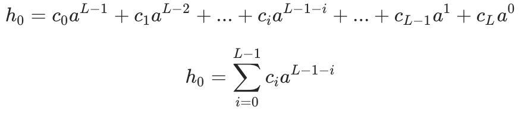
同时，对于滑动后的值，例如`abcd`滑动到`bcde`,相对位置数组[0,1,2,3]变为[1,2,3,4],其中，如果计算h的值，我们可以利用之前的公共部分[1,2,3]的值，计算后公式如下：
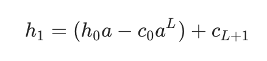

为了避免hash值过大导致的计算过程溢出，我们可以采用取模的方式，将计算出来的hash值都取模计算。
```java
/**
    * robin carp 实现
    *
    * @param haystack
    * @param needle
    * @return
    */
   public int strStr3(String haystack, String needle) {
       if (haystack.length() < needle.length()) {
           return -1;
       }
       if ("".equals(haystack) && "".equals(needle)) {
           return 0;
       }
       if (haystack.length() < 1) {
           return -1;
       }
       if (needle.length() < 1) {
           return 0;
       }
       long module = (long) Math.pow(2, 31); //控制在2的31次之下
       int baseNum = 26;
       //先计算初始hash值
       long hashHaystack = 0;
       long hashNeedle = 0;
       int l = needle.length();
       for (int index = 0; index < l; index++) {
           hashNeedle = (hashNeedle * baseNum + charToIntVale(needle.charAt(index))) % module;
           hashHaystack = ((hashHaystack * baseNum) + charToIntVale(haystack.charAt(index))) % module;
       }
       if (hashHaystack == hashNeedle) {
           return 0;
       }

       long aL = 1;
       for (int i = 1; i <= l; ++i) aL = (aL * baseNum) % module;

       for (int index = 1; index < haystack.length() - l + 1; index++) {
           hashHaystack = (hashHaystack * baseNum -
                   charToIntVale(haystack.charAt(index - 1)) * aL
                   + charToIntVale(haystack.charAt(index + l - 1))) % module;
           if (hashHaystack == hashNeedle) {
               return index;
           }
       }
       return -1;
   }
```
其中模值为`long module = (long) Math.pow(2, 31)`; `a`的取值为26，代表26个小写字母的数目；

# 4. Boyer Moore
对于前面的暴力匹配算法，我们每次遇到不匹配，都是固定往前移动一位，如果我们每次移动时候，能根据字符的匹配情况，做出判断，多移动一些位置，是不是就能提高我们的执行效率呢？
在看BM算法之前，我们还是得先来了解几个概念，以帮助我们理解主体程序。
## 坏字符
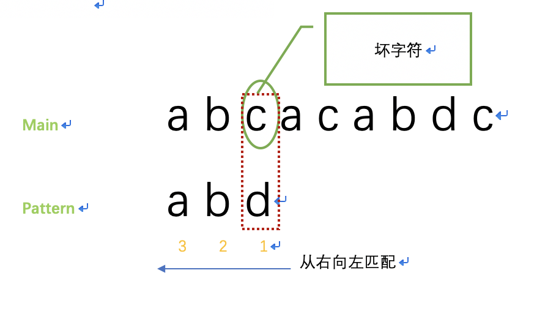

如图中，对于主串 `Main = abcacabdc`和模式匹配串`Pattern = abd`,第一次匹配时，注意这个匹配顺序，跟BF是相反的，BF是从第一个字符往后匹配，BM是从字符串的末尾向前匹配。
第一次比较时候，`Main`的`c`和`Pattern`的`d`并未匹配上，这时候，这个`c`,即为一个坏字符。
- 需要注意的是，坏字符指的是主串中的字符。


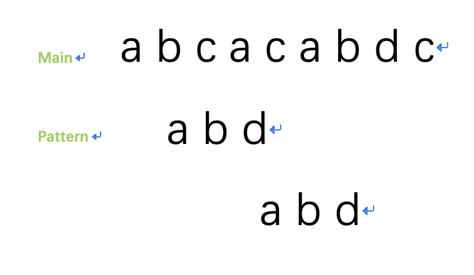
第一次匹配就没有匹配上，按照BF的算法，我们此时应该往后移动一位，但是我们可以观察，这里的`c`没在`Pattern`字符内，就算是按照BF法则移动，只要在`c`之前进行匹配，都是匹配不上的，所以，这里我们就直接的大胆的将`Pattern`移动到`c`的后一位。

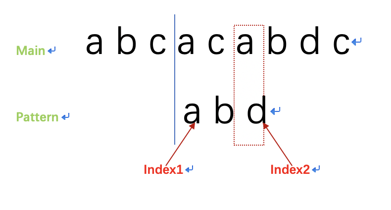

移动之后，我们这是对比`Main`的`a`和`Pattern`的`d`,发现仍旧不匹配，但是这次我们不能直接往后移动三位，因为我们发现，`Main`的`a`能跟`Pattern`内的的字符`a`匹配上，这时候，我们只能往后移动两位了，让`Main`的`a`和`Pattern`的`a`对齐....
看完这两种不匹配的坏字符情况，我们总结下规律：
- 1 ，当坏字符不在`Pattern`内，这种的比较简单，我们可以直接移动到坏字符的后面一位。
- 2，当坏字符在`Pattern`内，我们这时候就要去选择让坏字符对齐`Pattern`内的相同字符了。另外，如果`Pattern`内能匹配到多个坏字符，我们应该选择移动位数最小的那个，也就是最考后的那个，免得滑动过头了，错过。
- 3,当存在上面`2`的情况时候，如何计算移动距离？如上图，`Pattern`匹配坏字符的那一位位于`Pattern`的`index2`的位置，坏字符同样也在`Pattern`的`index1`的位置出现，那么`Pattern`的移动距离，可用`index2 - index1`得出。
## 坏字符实现
下面为坏字符表生成代码，通过生成一个可以在常数时间范围内查找的数组，来方便计算移动距离：
```java
/**
    * 生成坏字符查找表
    *
    * @param pattern
    * @return
    */
   public int[] generateBadWordsLookForTables(String pattern) {
       int[] data = new int[256];
       for (int i = 0; i < 255; i++) {
           data[i] = -1;
       }
       for (int i = 0; i < pattern.length(); i++) {
           int v = pattern.charAt(i);
           data[v] = i;
       }
       return data;
   }
```

## 好后缀规则
这个规则跟前面`KMP`对公共前后缀的信息利用有部分逻辑是相似的。

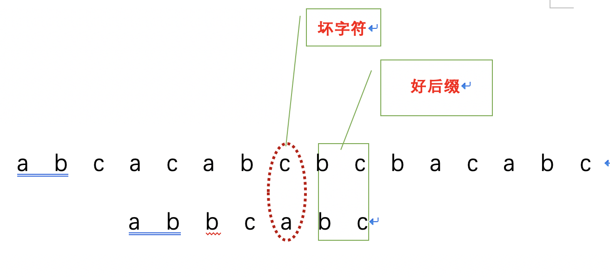

如上图，当匹配到如上图所示位置的时候，尾部`bc`能匹配上，继续往前，遇到匹配不上的坏字符，这时候`bc`,就是好后缀。
下面根据好后缀能否在模式串中被匹配到的情况进行讨论：
- 1，能在模式串中匹配到
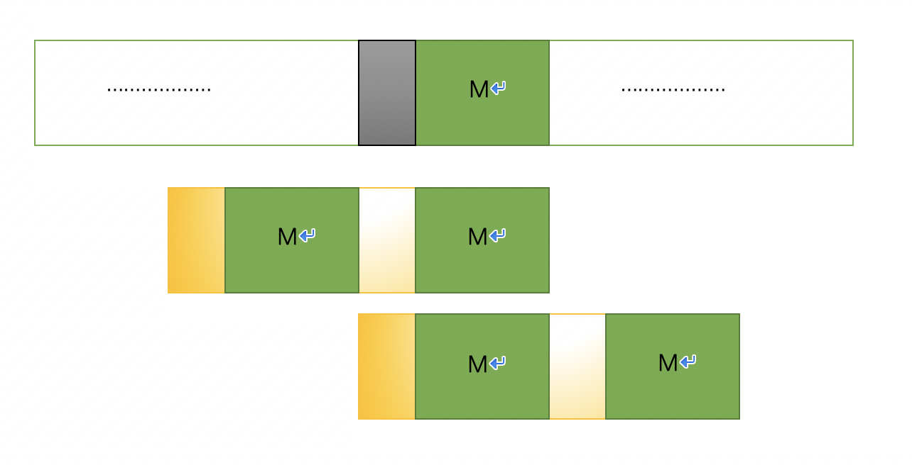

如上图，对于，好后缀`M`，在遇到坏字符匹配，匹配中止的时候，可以在`Pattern`里面查找，是否在`Pattern`中存在`M`,如果存在，可以将`Pattern`中匹配到的其他`M`段直接与`Main`段的`M`重合。

- 2，不能在模式串中匹配到

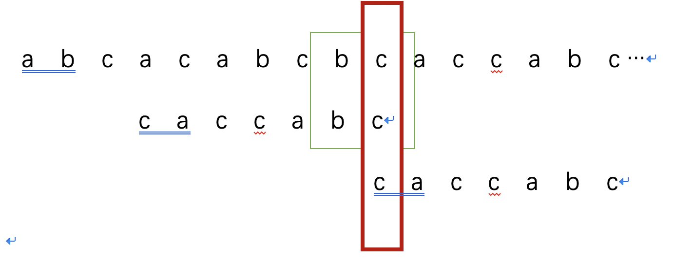
如上图，当进行到第二行匹配过程时候，好后缀`bc`不能在模式串中匹配到时候，如果我们直接移动到`bc`去匹配，显然是会错过匹配位置。所以这时候，我们还是需要看一下`Pattern`前后缀是否有公共部分，如果有公共部分，则将公共部分进行重合，再开始新一轮判断即可。

## 坏字符 or 好后缀
根据上面的规律，当我们在尾部向前匹配卡住的时候，我们应该去选择坏字符的规则获取移动距离还是按照好后缀的原则去移动呢？

-  总结： 两个移动距离，选择移动距离大的，就跟用两个网嵌套去捕鱼，肯定是比较细密的网补到的鱼多。

## 好后缀实现

例如：pattern=`c a b c a b`,我们先列举出它的后缀字串及其长度：
后缀字串|长度(k)|
---|:--:|
b|1|
ab|2|
cab|3|
bcab|4|
abcab|5|
我们来定义数组`suffix`:下标为上表的长度`k`,取值上表后缀字串在`pattern`能在模式串中匹配到的字符下标，下面我们来列个表：
后缀字串|长度(k)|suffix
---|:--:|:--:|
b|1|suffix[1]=2
ab|2|suffix[1]=1
cab|3|suffix[1]=0
bcab|4|suffix[1]=-1
abcab|5|suffix[1]=-1
- 注：不能匹配到这里下标记为了-1，如果匹配到头部字符串，值为0。
下面我们来实现生成`suffix`:
```Java
public int[] generateSuffix(String pattern) {
      int patternLength = pattern.length();
      int[] suffix = new int[patternLength]; //value为前缀出现位置
      for (int i = 0; i < patternLength; i++) {
          suffix[i] = -1;
      }
      for (int i = 0; i < patternLength - 1; i++) {
          int j = i;
          int k = 0; //长度
          while (j >= 0 && pattern.charAt(j) == pattern.charAt(patternLength - 1 - k)) {
              j--;
              k++;
              suffix[k] = j + 1;
          }
      }
      return suffix;
  }
```

## 好后缀的移动
- 1，对于长度为k的好后缀，如果在`suffix[k]!=-1`,则，往后移动`j-suffix[k]+1`（j表示当前坏字符的位置）

- 2，`suffix[k]==-1`，则pattern中不存在匹配的好后缀，此时，坏字符j,的后两位到尾部r的范围为：`[j+2，patternLength-1]`,这段字符内如果有可以匹配的前缀，则`k = patternLength - r`.如果存在`suffix[k]==0`，则我们可以将字符串滑动r位。
- 3，如果前两天都没匹配到，我们可以直接往后移动` patternLength`.
代码实现：
```Java

    public int moveByGoodStr(int j, int patternLength, int[] suffix) {
        int k = patternLength - 1 - j; //好后缀的长度
        if (suffix[k] != -1) {
            //在前面匹配到了好后缀
            return j - suffix[k] + 1;
        }
        //没匹配到，从j+2开始往后看能不能匹配到好后缀
        for (int r = j + 2; r <= patternLength - 1; r++) {
            if (suffix[patternLength - r] == 0) {
                return r;
            }
        }
        return patternLength;
    }
```

## 整体实现

```Java
public int strStr(String main, String pattern) {
        if (main.length() < pattern.length()) {
            return -1;
        }
        if ("".equals(main) && "".equals(pattern)) {
            return 0;
        }
        if (main.length() < 1) {
            return -1;
        }
        if (pattern.length() < 1) {
            return 0;
        }
        int mainLength = main.length();
        int patternLength = pattern.length();
        int[] badWordsTable = generateBadWordsLookForTables(pattern);
        int[] suffix = generateSuffix(pattern); //value为前缀出现位置

        int i = 0; //目前匹配的头部index
        while (i <= mainLength - patternLength) {
            int indexPattern;
            for (indexPattern = patternLength - 1; indexPattern >= 0; indexPattern--) {
                //从后往前匹配
                if (main.charAt(i + indexPattern) != pattern.charAt(indexPattern)) {
                    break;
                }
            }
            if (indexPattern < 0) {
                //匹配成功
                return i;
            }
            int badMove = indexPattern - badWordsTable[main.charAt(i + indexPattern)];
            int goodMove = 0;
            if (indexPattern < patternLength - 1) {
                goodMove = moveByGoodStr(indexPattern, patternLength, suffix);
            }
            i = i + Math.max(badMove, goodMove);
        }
        return -1;
    }
```

# 5. Sunday
首先来说下 Sunday 的整体思想:Sunday算法是从前往后匹配，在匹配失败时关注的是主串中参加匹配的最末位字符的下一位字符.
- 1.如果该字符没有在模式串中出现则直接跳过，即移动位数 = 模式串长度 + 1
- 2.否则，其移动位数 = 模式串长度 - 该字符最右出现的位置(以0开始) = 模式串中该字符最右出现的位置到尾部的距离 + 1

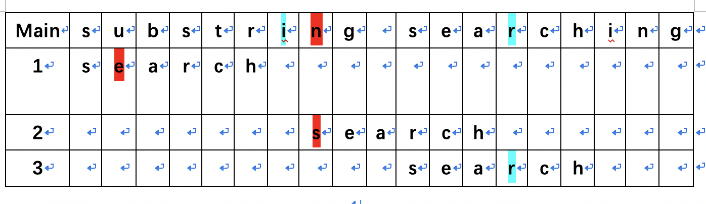

首先，我们来举个栗子，说明下Sunday是如何进行匹配的。
主串：` Main = substring searching `,模式串：`Pattern = search`。。

- 1，第一次匹配时候，匹配到主串的`u`,此时不匹配了，看主串中参加匹配的最末位字符的下一位字符`i`,此时`i`不在`Pattern`内，直接移动 `模式串长度 + 1`，跟后面的`n`对齐了。

- 2，`n`又遇到了不匹配的情况，看下`r`,`r`在`Pattern`内，将主串中的`r`与模式串的`r`对齐，此时移动位数为`模式串长度 - 该字符最右出现的位置(以0开始)`。关于有多个匹配情况，同上面的BM一样，移动到最靠近末尾的匹配字符，也就是多个字符匹配时候，移动最小的距离。
- 3，再repeat上面过程。
## 偏移表
偏移表的作用是存储每一个在模式串中出现的字符，在模式串中出现的最右位置到尾部的距离 +1，例如 `aab`:
- a 的偏移位就是 len(pattern)-1 = 2
- b 的偏移位就是 len(pattern)-2 = 1
- 其他的均为 len(pattern)+1 = 4

计算偏移表的过程，其实跟我们之前计算前后缀作用类似，也是做一个预处理的工作，方便我们移动时候，查表就行了。

下面给出计算偏移表的公式：
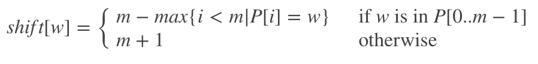


这个逻辑简直比BM不要太简单了，下面来写两行代码看看：

```Java
int[] generateShiftTable(String pattern) {
       int[] data = new int[256];
       int patternLength = pattern.length();
       for (int i = 0; i < 255; i++) {
           data[i] = patternLength + 1;
       }
       for (int i = 0; i < patternLength; i++) {
           int v = pattern.charAt(i);
           data[v] = patternLength - i;
       }
       return data;
   }
```

之后，我们根据偏移表来移动匹配下字符：

```Java
public int strStr5(String main, String pattern) {
        if (main.length() < pattern.length()) {
            return -1;
        }
        if ("".equals(main) && "".equals(pattern)) {
            return 0;
        }
        if (main.length() < 1) {
            return -1;
        }
        if (pattern.length() < 1) {
            return 0;
        }
        int[] shiftData = generateShiftTable(pattern);
        int index = 0;
        while (index + pattern.length() <= main.length()) {
            String mainTemp = main.substring(index, index + pattern.length());
            if (mainTemp.equals(pattern)) {
                return index;
            }
            if (index + pattern.length() >= main.length()) {
                return -1;
            }
            //根据偏移表偏移
            char r = main.charAt(index + pattern.length());
            index += shiftData[r];
        }
        return index + pattern.length() >= main.length() ? -1 : index;
    }
```
