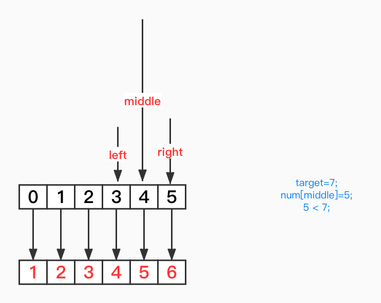

# 一，单数组的双指针法
## 从两端到中间的双指针法

例如，对于字符串`abc`,我们要对字符串进行反转，将字符串反转为`cba`。


可以使用一个初始位置在头部的指针`pLeft`，另一个起始位置在尾部的指针`pRight`，将两个指针同时向中间移动。


当为奇数个数组的时候，两个指针在中位相遇，当为偶数时候，两指针会在两个字符的中间位置相遇。
下面我们来简单实现上面这个过程：
```java
public char[] reverseString(char[] source) {
       int pLeft = 0;
       int pRight = source.length - 1;
       while (pLeft<= pRight) {
           char temp = source[pLeft];
           source[pLeft] = source[pRight];
           source[pRight] = temp;
           pLeft++;
           pRight--;
       }
       return source;
   }
```
## 快慢指针

> 给你一个数组 nums 和一个值 val，你需要 原地 移除所有数值等于 val 的元素，并返回移除后数组的新长度.

例如，以数组`[2,2,3]`为例，查找`val = 2`的值，原地移除。


首先来说下快慢指针在这里的作用：
- 慢指针用于快指针将后面元素移动到前面时候定位。
- 快指针用于向后扫描值为val位置。
```java
public int removeElement(int[] nums, int val) {
        int fast = 0;
        int slow = 0;
        while (fast <= nums.length - 1) {
            if (nums[fast] != val) {
                nums[slow] = nums[fast];
                slow++;
            }
            fast++;
        }
        return slow;
    }
```

# 二，双数组的双指针法
> 例如：存在两个有序数组，nums1,nums2,将两个有序数组合并成一个新的有序数组。


对于数组`nums1`,`nums2`, 分别对这两数组设置指针，移动指针，取小的数字作为当前位上的值。
这里，我们使用一个`num1Copy`作为原始`nums1`数组的拷贝，将原来数组`nums1`作为存放合并结果的数组。


```java
public void merge(int[] nums1, int m, int[] nums2, int n) {


        int[] num1Copy = new int[m + n]; //用于存放nums1原始数据
        System.arraycopy(nums1, 0, num1Copy, 0, m);
        int p1 = 0; //num1Copy 指针
        int p2 = 0; //nums2 指针
        int p = 0;//nums1 指针
        while (p1 < m && p2 < n) {
            if (num1Copy[p1] > nums2[p2]) {
                nums1[p++] = nums2[p2++];
            } else {
                nums1[p++] = num1Copy[p1++];
            }
        }
        if (p1 < m) {
            System.arraycopy(num1Copy, p1, nums1, p, m - p1);
        }
        if (p2 < n) {
            System.arraycopy(nums2, p2, nums1, p, n - p2);
        }
    }
```


# 三，二分法
## 二分法介绍
我们首先来看一个数组的查找问题，对于升序数组`nums`,在数组中查找`target`,并返回`target`在`nums`中的索引位置。如果未找到返回-1。
首先我们用最简单的无脑暴力法，从`index=0`的位置开始，往后依次对比，如果对比成功返回当前位置，如果不成功返回-1.
```java
public static int search(int[] nums, int target) {
       for (int index = 0; index < nums.length; index++) {
           if (nums[index] == target) {
               return index;
           }
       }
       return -1;
   }
```
从平均时间复杂度来看，这段代码复杂度为O(n)。
再回到题目，数组`nums`是升序的，这一点是我们在代码中没有利用到的条件，如果我们第一次先去比较数组中间的数字`nums[middle]`，如果`nums[middle]`比我们的目标值大，则说明我们还得往靠左找，往右找肯定是没有；如果`nums[middle]`比我们的目标值小，则说明我们要往右搜索。
我们每次的判断，都是将数组一分为二，每次一分为二的去将目标值所在范围尽可能缩小。
例如，`nums=[1,2,3,4,5,6]`,要查找的`target = 5`,查找`target`在`nums`中的位置。

## 二分法模板1

令初始时，`left = 0, right = length-1`,

此时，`num[mid]=3`,我们要查找的数值5比3大，说明我们还要往后查找才有可能找到5.此时我们要将`left`指针往右移动，移动到mid右侧，此时剩余的查找范围为`[mid+1,right]`;


移动完`left`指针之后，此时计算`mid`，获取到`nums[mid]=5`,刚好是我们要查找的值，完成。
下面还提供了了个gif图，可以连起来看看。

总结 ：
- 当`nums[mid] = target`,此时mid即为查找位置。
- 当`nums[mid]`不是查找目标时候，如果`nums[mid]>target`，则说明查找目标在左侧，并且`nums[mid]!=target`则，我们的右指针可以移动到mid左侧。
- 当`nums[mid]`不是查找目标时候，如果`nums[mid]<target`，则说明查找目标在右侧，并且`nums[mid]!=target`则，我们的左指针可以移动到`mid`侧。

```java
/**
     * 关键属性:
     * * 二分查找的最基础和最基本的形式。
     * * 查找条件可以在不与元素的两侧进行比较的情况下确定（或使用它周围的特定元素）。
     * * 不需要后处理，因为每一步中，你都在检查是否找到了元素。如果到达末尾，则知道未找到该元素。
     * *********************************************************************************
     * 区分语法:
     * * 初始条件：left = 0, right = length-1
     * * 终止：left > right
     * * 向左查找：right = mid-1
     * * 向右查找：left = mid+1
     *
     * @param nums
     * @param target
     * @return
     */
    public static int binarySearch1(int[] nums, int target) {
        if (nums == null || nums.length == 0)
            return -1;

        int left = 0, right = nums.length - 1;
        while (left <= right) {
            // Prevent (left + right) overflow
            int mid = left + (right - left) / 2;
            if (nums[mid] == target) {
                return mid;
            } else if (nums[mid] < target) {
                left = mid + 1;
            } else {
                right = mid - 1;
            }
        }
        // End Condition: left > right
        return -1;
    }
```
这种的模板是比较好理解的，下面两种，都可以看做是基于这种模板的变种。

## 二分法模板2


可以把索引`6`当做不会达到的位置，我们更改下`target`的值，`mid`还是计算`left`和`right`的中间值，通过将`target`与中间值进行比较，如上图，`nums[mid]<target`时候，`left`的移动位置还是`mid+1`。


继续比较，发现中间值还是小，`left`再移动跟`right`重合了。


此时，我们需要单独判断，剩下的这个位置。发现这个位置不存在数值，未找到我们的目标值。
下面为完整的过程：


```java
/**
    * 关键属性：
    * * 一种实现二分查找的高级方法。
    * * 查找条件需要访问元素的直接右邻居。
    * * 使用元素的右邻居来确定是否满足条件，并决定是向左还是向右。
    * * 保证查找空间在每一步中至少有 2 个元素。
    * * 需要进行后处理。 当你剩下 1 个元素时，循环 / 递归结束。 需要评估剩余元素是否符合条件。
    * *********************************************************************************
    * 区分语法:
    * * 初始条件：left = 0, right = length
    * * 终止：left == right
    * * 向左查找：right = mid
    * * 向右查找：left = mid+1
    *
    * @param nums
    * @param target
    * @return
    */
   public static int binarySearch2(int[] nums, int target) {
       if (nums == null || nums.length == 0)
           return -1;

       int left = 0, right = nums.length;
       while (left < right) {
           // Prevent (left + right) overflow
           int mid = left + (right - left) / 2;
           if (nums[mid] == target) {
               return mid;
           } else if (nums[mid] < target) {
               left = mid + 1;
           } else {
               right = mid;
           }
       }

       // Post-processing:
       // End Condition: left == right
       if (left != nums.length && nums[left] == target) return left;
       return -1;
   }
```

这种移动方式，最后会剩余下一个元素，需要一个后处理的判断，来确定最后一个元素是否是我们查找的元素。

## 二分法模板3
`nums`还是数组`[1,2,3,4,5,6]`,`target=7`,查找`target`。左右指针初始位置还是在头部和尾部。


但是移动时，左右指针都只移动到`middle`中间位置。



移动到最后，只剩下`left`和`right`指针分别指向剩余的两个位置，需要单独比较剩余的两个数值，是否是我们在查找的`target`。


下面是移动的全过程：


代码实现：

```java
/**
     * 关键属性：
     * * 实现二分查找的另一种方法。
     * * 搜索条件需要访问元素的直接左右邻居。
     * * 使用元素的邻居来确定它是向右还是向左。
     * * 保证查找空间在每个步骤中至少有 3 个元素。
     * * 需要进行后处理。 当剩下 2 个元素时，循环 / 递归结束。 需要评估其余元素是否符合条件。
     * *********************************************************************************
     * 区分语法:
     * * 初始条件：left = 0, right = length-1
     * * 终止：left + 1 == right
     * * 向左查找：right = mid
     * * 向右查找：left = mid
     *
     * @param nums
     * @param target
     * @return
     */
    public static int binarySearch3(int[] nums, int target) {
        if (nums == null || nums.length == 0)
            return -1;
        //left---mid ----target
        int left = 0, right = nums.length - 1;
        while (left + 1 < right) {
            // Prevent (left + right) overflow
            int mid = left + (right - left) / 2;
            if (nums[mid] == target) {
                return mid;
            } else if (nums[mid] < target) {
                left = mid;
            } else {
                right = mid;
            }
        }
        // Post-processing:
        // End Condition: left + 1 == right
        if (nums[left] == target) return left;
        if (nums[right] == target) return right;
        return -1;
    }
```
