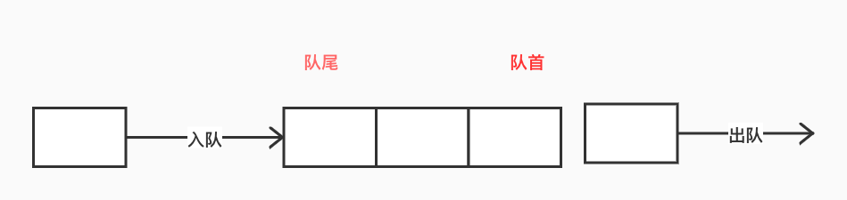
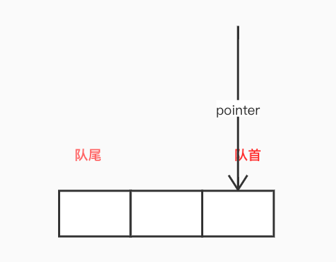
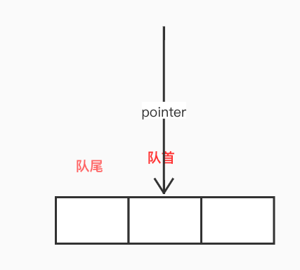
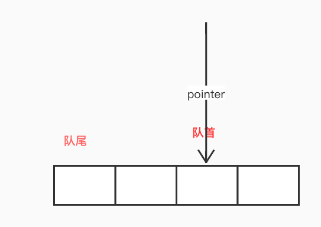
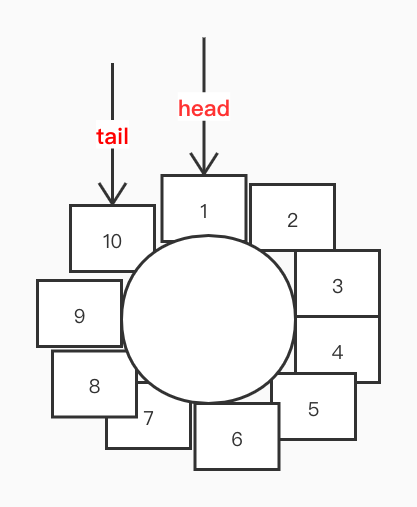
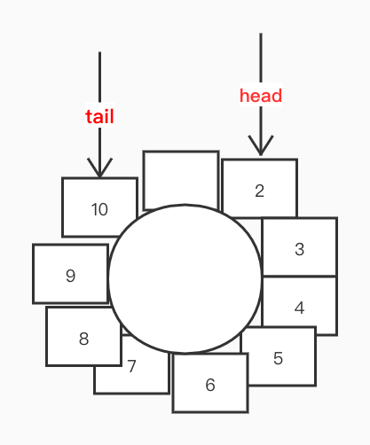
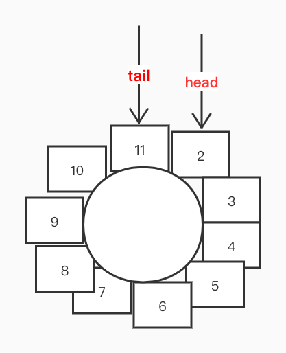

# 队列的基本操作
## 队列入队出队实现
队列是种先进先出的数据结构。
队列的基本操作主要是入队和出队。
数据从队尾进入队列，从队首出队列。


下面来写一个简单的队列:
```java
public class MyQueue {
    private List<Integer> data;
    private int pointer;

    public MyQueue() {
        data = new ArrayList<>();
        pointer = 0;
    }

    public boolean isEmpty() {
        return pointer >= data.size();
    }

    /**
     * Get the front item from the queue.
     */
    public int Front() {
        return data.get(pointer);
    }

    /**
     * Insert an element into the queue. Return true if the operation is successful.
     */
    public boolean enQueue(int x) {
        data.add(x);
        return true;
    }


    /**
     * Delete an element from the queue. Return true if the operation is successful.
     */
    public boolean deQueue() {
        if (isEmpty()) {
            return false;
        }
        pointer++;
        return true;
    }

}
```
其中,`pointer`代表头队首第一个位置的数据。

当头部有数据出队时，对应的`pointer`指针会往后移动一位。


如果有数据入队，会直接加在队尾：


我们会发现，随着队首数据的数据的出队，队首指针之前的空间都会被浪费掉，而且随着使用次数变多，空间浪费会越来越高。
为了重复使用这部分空间，避免浪费，我们可以设计一个队首与队尾相连接的队列，重复利用空间。
## 循环队列设计

如上图所示，数据`1  ~ 10`依次入队，队首`head`在`1`处，队尾`tail`在`10`处，如果将`1`出队列,`head`头指针将移动到`2`:

此时，有一个空位，我们还可以继续入队：

这样利用空间，刚好可以把队首浪费的空间利用上。
```java
class MyCircularQueue {

       private Integer[] data; //队列数据
       private Integer size;   //队列大小
       private Integer head = -1; //头指针
       private Integer tail = -1; //尾指针

       /**
        * 初始化队列
        */
       public MyCircularQueue(int k) {
           this.data = new Integer[k];
           this.size = k;
       }

       /**
        * 入队操作
        */
       public boolean enQueue(int value) {
           if (isFull()) {
               return false;
           }
           if (head == -1) {
               head++;
           }
           tail++;
           data[tail % size] = value;
           return true;
       }

       /**
        * 出队操作
        */
       public boolean deQueue() {
           if (isEmpty()) {
               return false;
           }

           if (head == tail % size) {
               head = -1;
               tail = -1;
           } else {
               head++;
           }
           return true;
       }

       /**
        * 获取队首元素
        */
       public int Front() {
           if (isEmpty()) {
               return -1;
           }
           return data[head];
       }

       /**
        * 获取队尾元素
        */
       public int Rear() {
           if (isEmpty()) {
               return -1;
           }
           return data[tail % size];
       }

       /**
        * 判断队列是不是为空
        */
       public boolean isEmpty() {
           return tail == -1 && head == -1;
       }

       /**
        * 检查队列是不是已经满了
        */
       public boolean isFull() {
           return (tail % size - head) == size - 1 || (head - tail % size) == 1;
       }
   }
```

# 广度优先搜索（BFS）及其实现
上面我们已经实现过基本的队列已经如果优化队列，下面我们来看一个队列在BFS(广度优先搜索)算法中的应用。
首先我们来定义结点：
```java
@Getter
  @Setter
  @EqualsAndHashCode
  @NoArgsConstructor
  class Node implements Serializable {
      private static final long serialVersionUID = 3687337665231315466L;
      String value;
      Collection<Node> previews; //前置结点
      Collection<Node> tails; //后置结点

      public Node(String value, Collection<Node> previews, Collection<Node> tails) {
          this.value = value;
      }

      public Node(String value) {
          this.value = value;
      }
  }
```
之后，我们先用队列来实现简单的`BFS`:
```java
int BFS(Node root, Node target) {
       Queue<Node> queue = new LinkedBlockingQueue();  // store all nodes which are waiting to be processed
       int step = 0;       // number of steps neeeded from root to current node
       queue.add(root);
       while (!queue.isEmpty()) {
           step++;
           int size = queue.size();
           for (int i = 0; i < size; i++) {
               Node cur = queue.poll();
               if (cur.equals(target)) {
                   return step;
               }
               if (cur.tails != null) {
                   for (Node node : cur.tails) {
                       queue.add(node);
                   }
               }
           }
       }
       return -1;
   }
```

另外，考虑到图结构中，像上面这样访问，可能会存在访问重复结点的情况，所以，我们记录下访问过的结点，访问过就直接跳过。
下面是改进算法：
```java
/**
    * 避免一个节点访问两次,单独检查访问过的结点
    *
    * @param root
    * @param target
    * @return
    */
   int BFS(Node root, Node target) {
       Queue<Node> queue = new LinkedBlockingQueue();  // store all nodes which are waiting to be processed
       Set<Node> userd = new HashSet<>(); // node that be used
       int step = 0;       // number of steps neeeded from root to current node
       queue.add(root);
       userd.add(root);
       while (!queue.isEmpty()) {
           step++;
           int size = queue.size();
           for (int i = 0; i < size; i++) {
               Node cur = queue.poll();
               if (cur.equals(target)) {
                   return step;
               }
               if (cur.tails != null) {
                   for (Node node : cur.tails) {
                       if (!userd.contains(node)) {
                           queue.add(node);
                           userd.add(node);
                       }
                   }
               }
           }
       }
       return -1;
   }
```
# Stack
与队列相反，`栈`是种先入后出的结构。
下面我们来看下`Java`里面的`栈`基本`入栈`和`出栈`是如何实现的：
首先是`入栈`操作：
```Java
/**
     * Pushes an item onto the top of this stack. This has exactly
     * the same effect as:
     * <blockquote><pre>
     * addElement(item)</pre></blockquote>
     *
     * @param   item   the item to be pushed onto this stack.
     * @return  the <code>item</code> argument.
     * @see     java.util.Vector#addElement
     */
    public E push(E item) {
        addElement(item);

        return item;
    }


    /**
     * Adds the specified component to the end of this vector,
     * increasing its size by one. The capacity of this vector is
     * increased if its size becomes greater than its capacity.
     *
     * <p>This method is identical in functionality to the
     * {@link #add(Object) add(E)}
     * method (which is part of the {@link List} interface).
     *
     * @param   obj   the component to be added
     */
    public synchronized void addElement(E obj) {
        modCount++;
        ensureCapacityHelper(elementCount + 1);
        elementData[elementCount++] = obj;
    }
```
`入栈` 操作即将数据插入数组尾部。`ps:入栈之前会去进行容量检查，如果不够，会进行内部数组的扩容操作，会重新产生大容量数组，并将原来老数组拷贝到新数组，完成扩容。过程跟ArrayList的类似。`

下面来看下`出栈`：
```Java
/**
     * Removes the object at the top of this stack and returns that
     * object as the value of this function.
     *
     * @return  The object at the top of this stack (the last item
     *          of the <tt>Vector</tt> object).
     * @throws  EmptyStackException  if this stack is empty.
     */
    public synchronized E pop() {
        E       obj;
        int     len = size();

        obj = peek();
        removeElementAt(len - 1);

        return obj;
    }


    public synchronized void removeElementAt(int index) {
       modCount++;
       if (index >= elementCount) {
           throw new ArrayIndexOutOfBoundsException(index + " >= " +
                                                    elementCount);
       }
       else if (index < 0) {
           throw new ArrayIndexOutOfBoundsException(index);
       }
       int j = elementCount - index - 1;
       if (j > 0) {
           System.arraycopy(elementData, index + 1, elementData, index, j);
       }
       elementCount--;
       elementData[elementCount] = null; /* to let gc do its work */
   }


```
这里，直接将数组尾部的数移除。

# 深度优先搜索（DFS）

首先来看`DFS`的简单递归实现：

```java
   /*
    * 基于递归实现DFS
    */
   boolean DFS(Node cur, Node target, Set<Node> visited) {
       if (cur == target) {
           return true;
       }
       if (cur.tails == null || cur.tails.size() < 1) {
           return false;
       }
       for (Node n : cur.tails) {
           visited.add(n);
           if (DFS(n, target, visited)) {
               return true;
           }
       }
       return false;
   }
```
基于递归的实现，系统会自动帮我们生成堆栈调用，但是如果递归的深度过高的话，终将造成堆栈溢出。这时候，我们就需要自己用`Stack`实现这一过程：
```Java
  /**
   * 基于stack
   *
   * @param cur
   * @param target
   * @return
   */
  boolean DFS(Node cur, Node target) {
      Set<Node> visited = new HashSet<>();
      Stack<Node> stack = new Stack();
      stack.push(cur);
      while (!stack.isEmpty()) {
          Node temp = stack.pop();
          if (temp == target) {
              return true;
          }
          for (Node n : temp.tails) {
              if (!visited.contains(n)) {
                  visited.add(n);
                  stack.push(n);
              }
          }
      }
      return false;
  }
```
