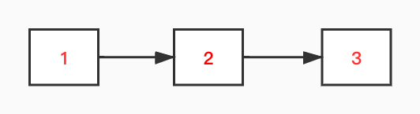
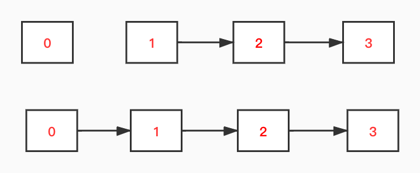
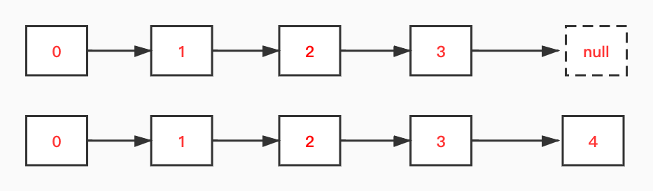
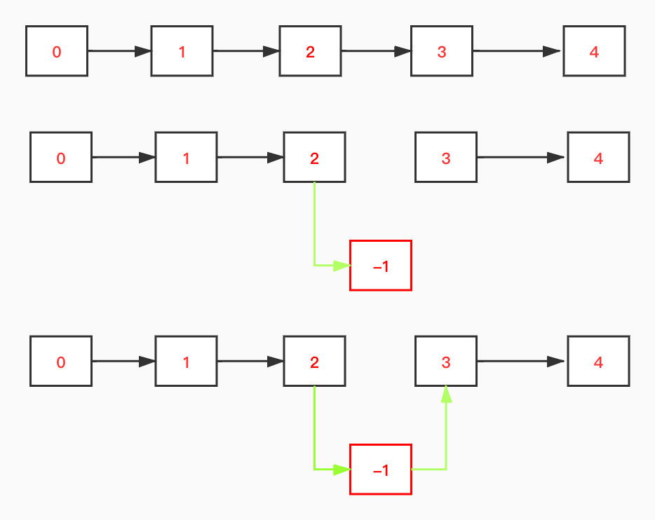
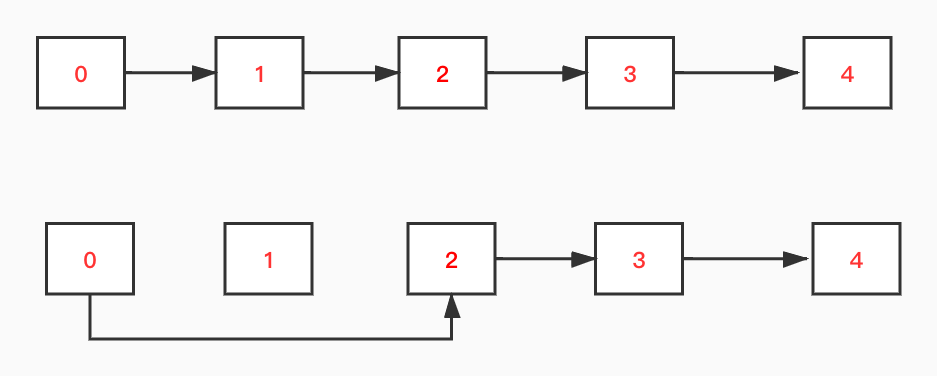
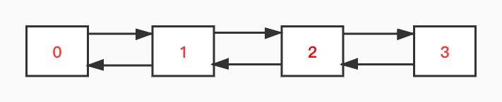

对于线性表来说，主要由顺序表示或链式表示。其中，顺序表示，我们在对应到实现的时候，经常使用数组进行实现。
利用数组来实现一个线性的结构，好处是元素随机访问的时间复杂度都控制在常数内，并且元素的物理存放位置固定。但是用数组存放，如果遇到数组空间不足的情况，常常需要进行扩容操作，如，我们Java中常见的的`ArrayList`实现，在进行扩容的时候，需要将原数组数据拷贝到新的数组空间中，这一操作数据量较大时候比较耗时。所以，如果对于不是很固定数量的一个存储，并且随机访问较少，此时，我们可以使用链表，不涉及扩容问题。

# 单链表基本操作
## 单链表构成


单链表每个节点，都含有值和一个指向下一个节点的指针，通过指针连接下一个节点。

对于单链表的节点，我们可以进行如下定义：

```java
class Node {
      int val;
      Node next;

      Node(int val) {
          this.val = val;
      }

      Node(int val, Node next) {
          this.val = val;
          this.next = next;
      }
  }
```
对于单链表的基本操作，有如下几种：添加节点，删除节点，获取节点。下面我们来实现这些操作。

先来定义下链表：

```java
class LinkedList {

       Node head; //头部
       int size; //长度
}
```
我们用`head`表示当前链表的头节点，`size`表示当前链表的长度。

## 添加操作
### 头部添加节点

首先我们构造好要添加的`node`，然后将新`node`的`next`指针指向当前链表的头结点，然后将本链表的头结点标记更新为新的头结点。
如果是空链表的添加，就比较简单了，只需要将新节点标记为当前链表头结点即可。
`ps:每次增删结点别忘记size变化`。
```java
public void addAtHead(int val) {
           Node newHead = new Node(val);
           if (size == 0) {
               head = newHead;
           } else {
               newHead.next = head;
               this.head = newHead;
           }
           size++;
       }
```
### 尾部添加结点

对于尾部的添加，首先要从头部开始，往下找到尾部结点，然后将尾部结点的`next`指针指向我们的新添加结点。
```java
public void addAtTail(int val) {
           if (size == 0) {
               return;
           }
           Node cur = head;
           while (cur.next != null) {
               cur = cur.next;
           }
           cur.next = new Node(val);
           size++;
       }
```
### 指定位置的添加


出去特殊的头部和尾部的添加，位于中间部位的添加，一般是分两步：

- 1，新节点的前置节点的`tail`结点指向新节点
- 2，新节点的`tail`结点指向原链表的后置结点

```java
public void addAtIndex(int index, int val) {
          if (index > size) {
              return;
          }
          Node cur = head;
          if (index <= 0) {
              addAtHead(val);
              return;
          }
          if (index == size) {
              addAtTail(val);
              return;
          }
          while (index > 1) {
              index--;
              cur = cur.next;
          }
          Node newNode = new Node(val, cur.next);
          cur.next = newNode;
          size++;
      }
```
## 删除操作



如上图，删除`index=1`的结点，将`index=1`的前置节点的`tail`指向`index=2`的结点，将`index=1`设置为等待回收的状态即可。


```java
public void deleteAtIndex(int index) {
           if (index < 0 || index >= size) {
               return;
           }
           if (index == 0) {
               head = head.next;
               size--;
               return;
           }
           Node cur = head;
           while (index > 1) {
               index--;
               cur = cur.next;
           }
           if (cur.next.next == null) {
               cur.next = null;
           }
           if (cur.next != null && cur.next.next != null) {
               cur.next = cur.next.next;
           }
           size--;
       }
```

## 获取操作
链表的获取需要从头部遍历到指定位置，不像数组那样，可以通过下标直接访问：
```java
public int get(int index) {
           if (index < 0 || index >= size) {
               return -1;
           }
           if (index == 0) {
               return head.val;
           }
           Node cur = head;
           while (index > 0) {
               index--;
               cur = cur.next;
           }
           return cur.val;
       }
```
# 双向链表的基本操作
## 双向链表的构成


与单链表相比，双向链表还有一个指针，指向其前置节点，节点实现如下:
```java
class Node {
       int val;
       Node prev; //前置节点
       Node next; //后置节点

       Node(int val) {
           this.val = val;
       }

       Node(int val, Node prev, Node next) {
           this.prev = prev;
           this.val = val;
           this.next = next;
       }
   }
```

双向链表的链表结构:

```java
class MyLinkedList {

      Node head; //头部
      int size; //长度

}
```
### 添加操作
```java

       public void addAtHead(int val) {
           Node newHead = new Node(val, null, head);
           if (head != null) {
               head.prev = newHead;
           }
           head = newHead;
           size++;

       }


       public void addAtTail(int val) {
           if (size == 0) {
               addAtHead(val);
               return;
           }
           Node oldTail = getNode(size - 1);
           Node newTail = new Node(val, oldTail, null);
           oldTail.next = newTail;
           size++;
       }


       public void addAtIndex(int index, int val) {
           if (index > size) {
               return;
           }
           if (index < 0 || index == 0) {
               addAtHead(val);
               return;
           }
           if (index == size) {
               addAtTail(val);
               return;
           }
           Node prev = getNode(index - 1);
           Node next = getNode(index);
           Node newNode = new Node(val, prev, next);
           prev.next = newNode;
           next.prev = newNode;
           size++;
       }
```
与单链表相比，双向链表的添加操作中，多出来了对于前置节点的操作，但是大体思路是一致的。
### 获取操作
双向链表的获取操作还是从头部往后的一个遍历操作，直至找到相对应索引位的结点。
```java
public int get(int index) {
           Node node = getNode(index);
           if (node == null) {
               return -1;
           }
           return node.val;
       }

       private Node getNode(int index) {
           if (index < 0 || index >= size) {
               return null;
           }
           Node cur = head;
           int idx = 0;
           if (index == 0) {
               return head;
           }
           while (cur.next != null) {
               idx++;
               cur = cur.next;
               if (idx == index) {
                   return cur;
               }
           }
           return null;
       }
```
### 删除操作
对于删除操作这里，获取到被删除的结点之后，就能通过被删除结点，获取到前后的结点，直接对前后结点操作即可，比单向链表感觉更简单。
```java
public void deleteAtIndex(int index) {
           if (index < 0 || index >= size) {
               return;
           }
           Node delNode = getNode(index);
           if (delNode == null) {
               return;
           }
           Node prevNode = delNode.prev;
           Node nextNode = delNode.next;
           if (prevNode != null) {
               prevNode.next = nextNode;
           }
           if (nextNode != null) {
               nextNode.prev = prevNode;
           }
           if (index == 0) {
               head = nextNode;
           }
           delNode.prev = null;
           delNode.next = null;
           size--;
       }
```
# 小结
本文主要介绍一些单链表基本操作，来帮助理解下链表各个操作的时间复杂度和空间复杂度，方便理解各类语言对于链表的实现，从而能更好的使用链表。读者看完本文之后，也可以尝试自己去实现一个简单链表。
