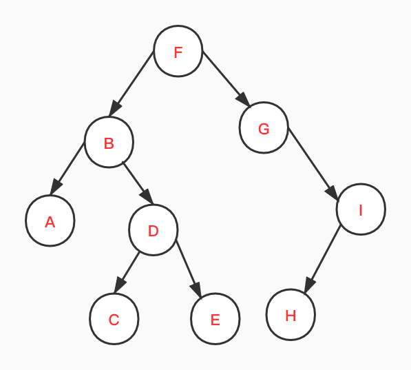
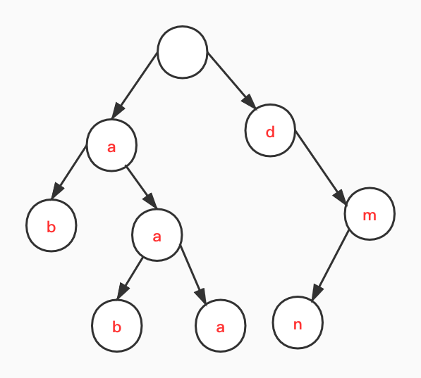

现在面试问mysql,红黑树好像都是必备问题了。动不动就让手写红黑树或者简单介绍下红黑树。然而，我们如果直接去看红黑树，可能会一下子蒙了。在看红黑树之前，需要先了解下树的基础知识，从简单到复杂，看看红黑树是在什么场景下出现的，是哪种东西。
本文主要是介绍二叉树，二叉搜索树，然后到高度平衡二叉树，根据树的基本操作和特点，帮助理解那些特殊结构的树，是怎样演化而来的。
# 二叉树（Binary tree）基本概念
二叉树（Binary tree）是树形结构的一个重要类型。看它这名字，就是最多有俩叉的一种特殊的树形结构。通常，它的俩叉分别叫做`左子树`和`右子树`。
对二叉树的结构定义如下：
```java
public class TreeNode {
    public int val;
    public TreeNode left;
    public TreeNode right;

    public TreeNode(int x) {
        val = x;
    }
}
```

# 二叉树的遍历


## 前序遍历
前序遍历首先访问根节点，然后遍历左子树，最后遍历右子树。
例如，对于如上图二叉树，访问的先后顺序依次是：`FBADCEGIH`。
下面使用简单递归来写个：
```java
//前序遍历首先访问根节点，然后遍历左子树，最后遍历右子树
    public List<Integer> preorderTraversal(TreeNode root) {
        List<Integer> result = new ArrayList<>();
        generate(root, result);
        return result;
    }

    private void generate(TreeNode root, List<Integer> result) {
        if (root == null) {
            return;
        }
        result.add(root.val);
        if (root.left == null && root.right == null) {
            return;
        }
        if (root.left != null) {
            generate(root.left, result);
        }
        if (root.right != null) {
            generate(root.right, result);
        }
    }
```


## 中序遍历
中序遍历是先遍历左子树，然后访问根节点，然后遍历右子树。
例如，对于如上图二叉树，访问的先后顺序依次是：`ABCDEFGHI`。
```java
public List<Integer> inorderTraversal(TreeNode root) {
      List<Integer> result = new ArrayList<>();
      inorderTraversal(root, result);
      return result;
  }

  /**
   * 递归方式求解
   *
   * @param root
   * @param result
   */
  void inorderTraversal(TreeNode root, List<Integer> result) {
      if (root.left != null) {
          inorderTraversal(root.left, result);
      }
      result.add(root.val);
      if (root.right != null) {
          inorderTraversal(root.right, result);
      }
  }
```

## 后序遍历
后序遍历是先遍历左子树，然后遍历右子树，最后访问树的根节点。
例如，对于如上图二叉树，访问的先后顺序依次是：`ACEDBHIGF`。
```java
public List<Integer> postorderTraversal(TreeNode root) {
       List<Integer> result = new ArrayList<>();
       generate(root, result);
       return result;
   }

   /**
    * 递归方法
    *
    * @param root
    * @param result
    */
   private void generate(TreeNode root, List<Integer> result) {
       //后序遍历是先遍历左子树，然后遍历右子树，最后访问树的根节点
       if (root == null) {
           return;
       }
       if (root.left != null) {
           generate(root.left, result);
       }
       if (root.right != null) {
           generate(root.right, result);
       }
       result.add(root.val);
   }

```


## 层次遍历
层序遍历就是逐层遍历树结构。
例如，对于如上图二叉树，访问的先后顺序依次是：`FBGADICEH`。
```java
public List<List<Integer>> levelOrder(TreeNode root) {
       List<List<Integer>> result = new ArrayList<>();
       if (root == null) {
           return result;
       }
       Queue<TreeNode> queue = new LinkedList<>();
       queue.add(root);
       while (!queue.isEmpty()) {
           int size = queue.size();
           List<Integer> item = new ArrayList<>();
           for (int i = 0; i < size; i++) {
               TreeNode n = queue.poll();
               item.add(n.val);
               if (n.left != null) {
                   queue.add(n.left);
               }
               if (n.right != null) {
                   queue.add(n.right);
               }
           }
           result.add(item);
       }
       return result;
   }
```
# 二叉树的深度
二叉树的深度为根节点到最远叶子节点的最长路径上的节点数。
是不是通过上面对于二叉树的遍历，发现，二叉树用递归方法，简直是太好写了，下面我们对这个深度的求解也使用递归：
```java

    int answer = 0;

    public int maxDepth(TreeNode root) {
        if (root == null) {
            return 0;
        }
        int depth = 1;
        depth(root, depth);
        return answer;
    }

    private void depth(TreeNode root, int depth) {
        if (root.left == null && root.right == null) {
            answer = Math.max(answer, depth);
        }
        if (root.left != null) {
            depth(root.left, depth + 1);
        }
        if (root.right != null) {
            depth(root.right, depth + 1);
        }
    }
```

到这里我们会发现，对于二叉树的遍历操作，几乎都可以用递归来解决，超简单呀。
# 二叉搜索树(BinarySearchTree)
## BST 定义
`BST`是二叉树的一种特殊表示形式，它满足如下特性:
- 1,每个节点中的值必须大于（或等于）存储在其左侧子树中的任何值
- 2,每个节点中的值必须小于（或等于）存储在其右子树中的任何值

我们可以把`BST`看成是进化了的二叉树。而且观察`BST`的这个特点，是不是让你想起来我们之前说过的数组的二分法，利用二分法对有序数组进行查找，可以提高搜索效率。如果对`BST`进行搜索，我们也可以充分利用`BST`的特征。
## 验证BST
对于二叉树，我们可以进行中序遍历（左中右），观察遍历得到的值是不是从小到大排列，可以使用此点验证二叉搜索树；
```java
LinkedList<Integer> data = new LinkedList<>();

    public boolean isValidBST(TreeNode root) {
        if (root == null) {
            return true;
        }
        if (root.left != null && !isValidBST(root.left)) {
            return false;
        }
        //左中右遍历，让值依次增大即可
        if (!data.isEmpty()) {
            Integer n = data.peekLast();
            if (n >= root.val) {
                return false;
            }
        }
        data.add(root.val);
        if (root.right != null && !isValidBST(root.right)) {
            return false;
        }
        return true;
    }
```
## BST基本操作
### 搜索
搜索的具体思路跟二分法也是蜜汁类似，不懂二分法的请翻看我以前写的关于数组的基本操作。
对于`BST`来说，如果当前比较数值过小，往右搜索，过大，往左搜索。
```java
public TreeNode searchBST(TreeNode root, int val) {
      if (root == null) {
          return null;
      }
      if (root.val == val) {
          return root;
      }
      if (root.val > val && root.left != null) {
          return searchBST(root.left, val);
      }
      if (root.val < val && root.right != null) {
          return searchBST(root.right, val);
      }
      return null;
  }
```
### 插入
对于插入操作也是一样的，在比较的基础上，找到合适的位置，哈哈。
```java
public TreeNode insertIntoBST(TreeNode root, int val) {
       if (root == null) {
           return root;
       }
       if (root.val > val && root.left == null) {
           root.left = new TreeNode(val);
           return root;
       }
       if (root.val < val && root.right == null) {
           root.right = new TreeNode(val);
           return root;
       }
       if (root.left != null && root.val > val) {
           insertIntoBST(root.left, val);
       }
       if (root.right != null && root.val < val) {
           insertIntoBST(root.right, val);
       }
       return root;
   }
```
### 删除
对于删除操作，可能比上面两种操作相对复杂一点。
- 1. 如果目标节点没有子节点，我们可以直接移除该目标节点。
- 2. 如果目标节只有一个子节点，我们可以用其子节点作为替换。
- 3. 如果目标节点有两个子节点，我们需要用其中序后继节点或者前驱节点来替换，再删除该目标节点。

对于 1 和 2，很好理解。对于3，我们先来看一个结点，值的大小顺序为：`左<中<右`，如果我们要删除中间结点并且还要保持这个顺序不变，则我们有两个方法：1，使用左侧树的最大值去掉中间结点；2，使用右侧最小值取代中间结点。这样才能使得转变之后的树还满足`BST`的特征。
代码如下：
```java
    /**
     * @param root
     * @param key
     * @return
     */
    public TreeNode deleteNode(TreeNode root, int key) {
        if (root == null) {
            return root;
        }
        if (root.val == key) {
            if (root.left == null && root.right == null) {
                return null;
            }
            if (root.left == null) {
                root = root.right;
                return root;
            }
            if (root.right == null) {
                root = root.left;
                return root;
            }
            root = getLeftChildMaxNode(root);
            return root;
        }
        if (root.val > key) {
            root.left = deleteNode(root.left, key);
            return root;
        }
        if (root.val < key) {
            root.right = deleteNode(root.right, key);
            return root;
        }
        return root;
    }

    /**
     * 转变右子树最小结点
     *
     * @param root
     * @return
     */
    private TreeNode getRightChildMinNode(TreeNode root) {
        if (root == null) {
            return root;
        }
        TreeNode left = root.left;
        TreeNode right = root.right;
        if (right.left == null) {
            right.left = left;
            return right;
        }
        //root的left直接挪到root.left的最小结点上
        TreeNode temp = right.left;
        while (temp.left != null) {
            temp = temp.left;
        }
        temp.left = left;
        return right;
    }

    /**
     * 转变左子树最大结点
     *
     * @return
     */
    private TreeNode getLeftChildMaxNode(TreeNode root) {
        if (root == null) {
            return root;
        }
        TreeNode left = root.left;
        TreeNode right = root.right;
        if (left.right == null) {
            left.right = right;
            return left;
        }
        TreeNode temp = left.right;
        while (temp.right != null) {
            temp = temp.right;
        }
        temp.right = right;
        return left;
    }
```
# 高度平衡二叉树
一个二叉树每个节点 的左右两个子树的高度差的绝对值不超过1。
如果二叉搜索树的高度为 h ，则时间复杂度为 O(h) 。所以，二叉搜索树的高度的确很重要。对于一个有N个结点，高度为h的二叉树，h>=${log_2{n}}$。对于具有 N 个节点的二叉搜索树的高度在 logN 到 N 区间变化。也就是说，搜索操作的时间复杂度可以从 logN 变化到 N 。这是一个巨大的性能差异。所以，我们应该尽量把二叉搜索树，往高度平衡的二叉搜索树上靠，来提高搜索效率。
## 高度平衡二叉树验证
emm,还是递归，超简单，按照定义写即可：
```java
Boolean res = true;

   public boolean isBalanced(TreeNode root) {
       singleBalanced(root);
       return res;
   }

   int singleBalanced(TreeNode root) {
       if (root == null) {
           return 0;
       }
       int left = singleBalanced(root.left) + 1;
       int right = singleBalanced(root.right) + 1;
       if (Math.abs(left - right) > 1) {
           res = false;
       }
       return Math.max(left, right);
   }
```
## 有序数组转换成高度平衡二叉搜索树
我们取数组的中间元素作为根结点， 将数组分成左右两部分，对数组的两部分用递归的方法分别构建左右子树。
感觉其实是二分法的反作用。
这个可以用于对于普通二叉搜索树，先用中序遍历，生成有序数组，之后，将有序数组构建成高度平衡二叉树。
这是采用拆解重构建的方式构造高度平衡二叉树的一种方法。之后，我们还会介绍通过调整普通二叉搜索树，构建高度平衡二叉树或者近似于高度平衡二叉树的方法。
```java
   public TreeNode sortedArrayToBST(int[] nums) {
       if (nums == null || nums.length == 0) {
           return null;
       }
       return build(nums, 0, nums.length - 1);
   }

   TreeNode build(int[] nums, int left, int right) {
       if (left == right) {
           return new TreeNode(nums[left]);
       }
       int mid = (left + right) / 2;
       TreeNode root = new TreeNode(nums[mid]);
       if (left + 1 == right) {
           root.right = new TreeNode(nums[right]);
           return root;
       }
       if (left + 2 == right) {
           root.left = new TreeNode(nums[left]);
           root.right = new TreeNode(nums[right]);
           return root;
       }
       root.left = build(nums, left, mid - 1);
       root.right = build(nums, mid + 1, right);
       return root;
   }
```
# N叉树
N叉树:一个结点有N个叉，哈哈。
二叉树属于N叉树的一个特例。
结点定义：
```java
class Node {
       public int val;
       public List<Node> children;

       public Node() {
       }

       public Node(int _val, List<Node> _children) {
           val = _val;
           children = _children;
       }
   }
```

## N叉树的遍历
## 前序遍历
```java

    public List<Integer> preorder(Node root) {
        List<Integer> res = new ArrayList<>();
        if (root == null) {
            return res;
        }
        res.add(root.val);
        if (root.children == null || root.children.size() < 1) {
            return res;
        }
        for (Node n : root.children) {
            List<Integer> items = preorder(n);
            res.addAll(items);
        }
        return res;
    }
```
## 后序遍历
```java
/**
    * 递归方法
    *
    * @param root
    * @return
    */
   public List<Integer> postorder(Node root) {
       List<Integer> res = new ArrayList<>();
       if (root == null) {
           return res;
       }
       postorder(root, res);
       return res;
   }

   void postorder(Node root, List<Integer> res) {
       if (root.children == null) {
           res.add(root.val);
           return;
       }
       for (Node n : root.children) {
           postorder(n, res);
       }
       res.add(root.val);
   }
```
## 层序遍历
```java
public List<List<Integer>> levelOrder(Node root) {
      List<List<Integer>> res = new ArrayList<>();
      if (root == null) {
          return res;
      }
      Queue<Node> queue = new LinkedList<>();
      queue.add(root);
      while (!queue.isEmpty()) {
          int size = queue.size();
          List<Integer> data = new ArrayList<>();
          for (int i = 0; i < size; i++) {
              Node node = queue.poll();
              data.add(node.val);
              if (node.children != null && node.children.size() > 0) {
                  queue.addAll(node.children);
              }
          }
          res.add(data);
      }
      return res;
  }
```
# 前缀树
## 前缀树定义

前缀树特点：
- 根节点不包含字符，除根节点外每一个节点都只包含一个字符；
- 从根节点到某一节点，路径上经过的字符连接起来，为该节点对应的字符串；
 - 每个节点的所有子节点包含的字符都不相同。

下面为两种常用前缀树的结构：
 1，使用数组来存储后缀结点：
```java
class TrieNode {
    public static final int N = 26;
    public TrieNode[] children = new TrieNode[N];
    // ......

}
````
 2，使用map来存储后缀结点：
```java
class TrieNode {
    public Map<Character, TrieNode> children = new HashMap<>();

    // ......
};
```

## 实现前缀树的插入和搜索
```java
class Trie {

       private Map<Character, TrieNode> data = new HashMap<>();


       public Trie() {

       }


       public void insert(String word) {
           if (word == null || word.isEmpty()) {
               return;
           }
           if (search(word)) {
               return;
           }
           char[] words = word.toCharArray();
           char head = words[0];
           TrieNode currt = data.get(head);
           if (currt == null) {
               currt = new TrieNode(head);
               data.put(head, currt);
           }
           for (int i = 1; i < words.length; i++) {
               char c = words[i];
               if (currt.next == null) {
                   currt.next = new ArrayList<>();
               }
               TrieNode target = currt.next.stream().filter(n -> n.c == c).findFirst().orElse(null);
               if (target == null) {
                   target = new TrieNode(c);
                   currt.next.add(target);
               }
               currt = target;
           }
           currt.isWord = true;
       }


       public boolean search(String word) {
           if (word == null || word.isEmpty()) {
               return false;
           }
           char[] words = word.toCharArray();
           char head = words[0];
           TrieNode currt = data.get(head);
           if (currt == null) {
               return false;
           }
           for (int i = 1; i < words.length; i++) {
               char c = words[i];
               if (currt.next == null || currt.next.size() == 0) {
                   return false;
               }
               List<TrieNode> next = currt.next;
               TrieNode t = next.stream().filter(n -> n.c == c).findFirst().orElse(null);
               if (t == null) {
                   return false;
               }
               currt = t;
           }
           return currt.isWord;
       }


       public boolean startsWith(String prefix) {
           if (prefix == null || prefix.isEmpty()) {
               return false;
           }
           char[] words = prefix.toCharArray();
           char head = words[0];
           TrieNode currt = data.get(head);
           if (currt == null) {
               return false;
           }
           for (int i = 1; i < words.length; i++) {
               char c = words[i];
               if (currt.next == null || currt.next.size() == 0) {
                   return false;
               }
               List<TrieNode> next = currt.next;
               TrieNode t = next.stream().filter(n -> n.c == c).findFirst().orElse(null);
               if (t == null) {
                   return false;
               }
               currt = t;
           }
           return true;
       }
   }
```
# 小结
本文从最简单的二叉树开始讲起，介绍了简单二叉树的遍历，
之后延伸到对于搜索友好的二叉搜索树，对比二叉搜索树和我之前chat里面讲过的二分法，你会发现，提高搜索效率的秘诀，在于构建有序的结构，之后尽量利用二分法的原理，使得搜索的时间复杂度靠近$log_2n$。
但是在实际操作中，我们会发现，将树维护在高度平衡内，实在是要耗费的力气太大了，于是不得不在高度平衡和构建树上做一个妥协，由此衍生出了很多工业级别的树，但是限于本文篇幅，这里没有涉及，或许我会在后续的chat安排上。

除了二叉树，本文还简单介绍了下N叉树和前缀树，简单了解下树的其他应用方式。
