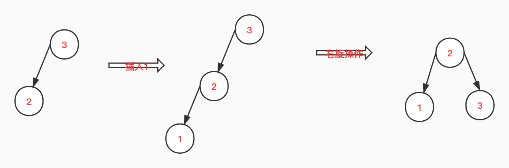
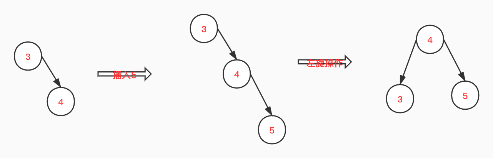
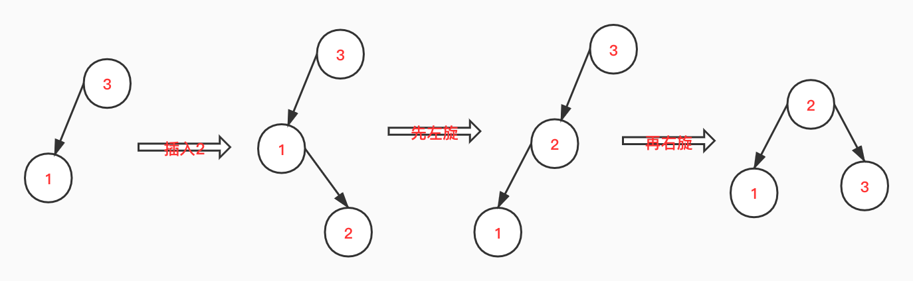
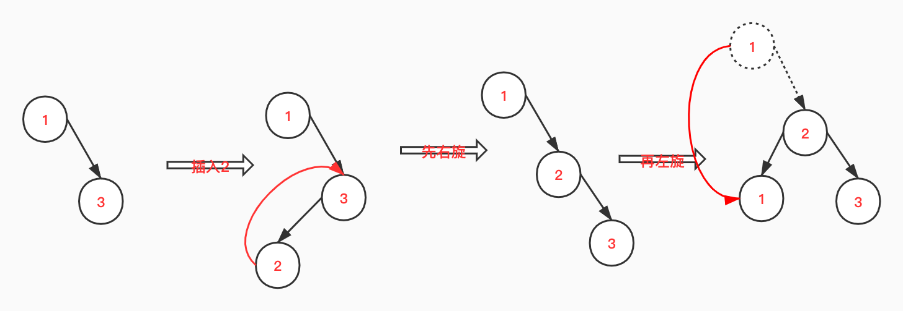

# AVL树定义
在AVL树中任何节点的两个子树的高度最大差别为1，所以它也被称为高度平衡树。增加和删除可能需要通过一次或多次树旋转来重新平衡这个树。AVL树得名于它的发明者G. M. Adelson-Velsky和E. M. Landis，他们在1962年的论文《An algorithm for the organization of information》中发表了它。--from 百度
# 平衡因子
某结点的左子树与右子树的高度(深度)差即为该结点的平衡因子（BF,Balance Factor）。平衡二叉树上所有结点的平衡因子只可能是 -1，0 或 1。
# 旋转
有四种种情况可能导致二叉查找树不平衡，分别为：

- LL：插入一个新节点到根节点的左子树（Left）的左子树（Left），导致根节点的平衡因子由1变为2

- RR：插入一个新节点到根节点的右子树（Right）的右子树（Right），导致根节点的平衡因子由-1变为-2

- LR：插入一个新节点到根节点的左子树（Left）的右子树（Right），导致根节点的平衡因子由1变为2

- RL：插入一个新节点到根节点的右子树（Right）的左子树（Left），导致根节点的平衡因子由-1变为-2

针对因为插入可能造成的不平衡情况，可以通过旋转来使得树保持平衡。AVL树的基本操作是旋转，有四种旋转方式，分别为：左旋转，右旋转，左右旋转（先左后右），右左旋转（先右后左）；
下面我们针对二叉查找树不平衡的不平衡情况，来讨论如何进行旋转。
## LL
在根节点的左子树的左子树上，如下图，插入1到原来树，左子树的高度变为2，造成了跟结点3的平衡因子由1变成了2，此时我们对3进行右旋操作，2变成了根节点。

## RR
在根节点右子

## LR

## RL

# 删除结点
